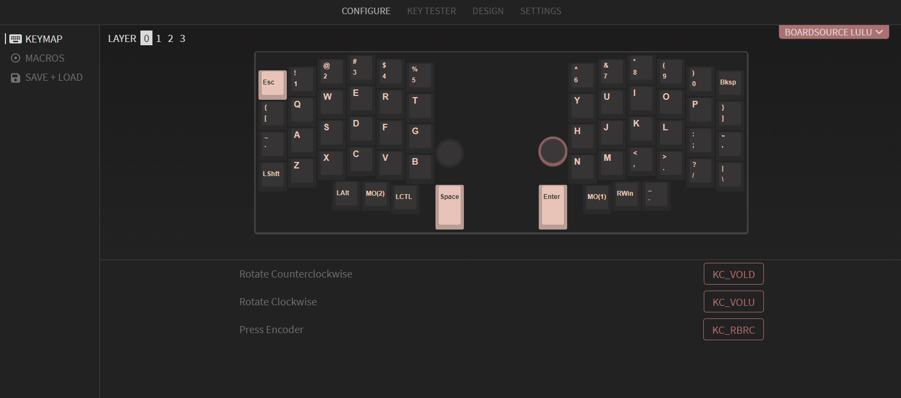

# Boardsource LULU keyboard

This contains the steps I took to get the lulu keyboard working in VIA, including encoders.

Roughly, I had to:

1. Solder the rotary encoders. (Only the button is hot swap, the rotary encoder part still needs to be soldered!)
   1. [Build Guide](https://boardsource.xyz/help/612317c39c85c6050be18f95)
2. Compile a new QMK firmware with Encoders enabled. (using [qmk-wsl](https://qmk.github.io/qmk_distro_wsl/) or [qmk cli](https://github.com/qmk/qmk_cli))
   1. [QMK documentation](https://qmk.github.io/qmk_mkdocs/master/en/feature_encoders/) on enabling encoders.
   2. [VIA change](https://github.com/qmk/qmk_firmware/pull/17734) enabling encoder support.
3. Copy new [`.uf2` file](boardsource_lulu_rp2040_via.uf2) to each half.
   1. [Flash guide](https://boardsource.xyz/help/6306d4840b62f46fa9448c0b)
4. Create a new lulu .json config for via including encoder support.
   1. You can use the [Keyboard Layout Editor](http://www.keyboard-layout-editor.com/#/) for this.
   2. You can copy [the layout](keyboard-layout-lulu.json) I made directly in the `Raw data` tab.
5. Activate the [`Design` tab](https://usevia.app/#/design) in [VIA](https://usevia.app/#/) ([Settings](https://usevia.app/#/settings) --> `Show Design Tab`)
6. Upload the [json config](boardsource_lulu_via_config.json) for lulu in the Design tab.
7. Adjust any keys and rotary encoders to your liking.

I'm including the files I built in this folder, use at your own risk.
(Feel free to edit, share and do whatever you like with them!)

